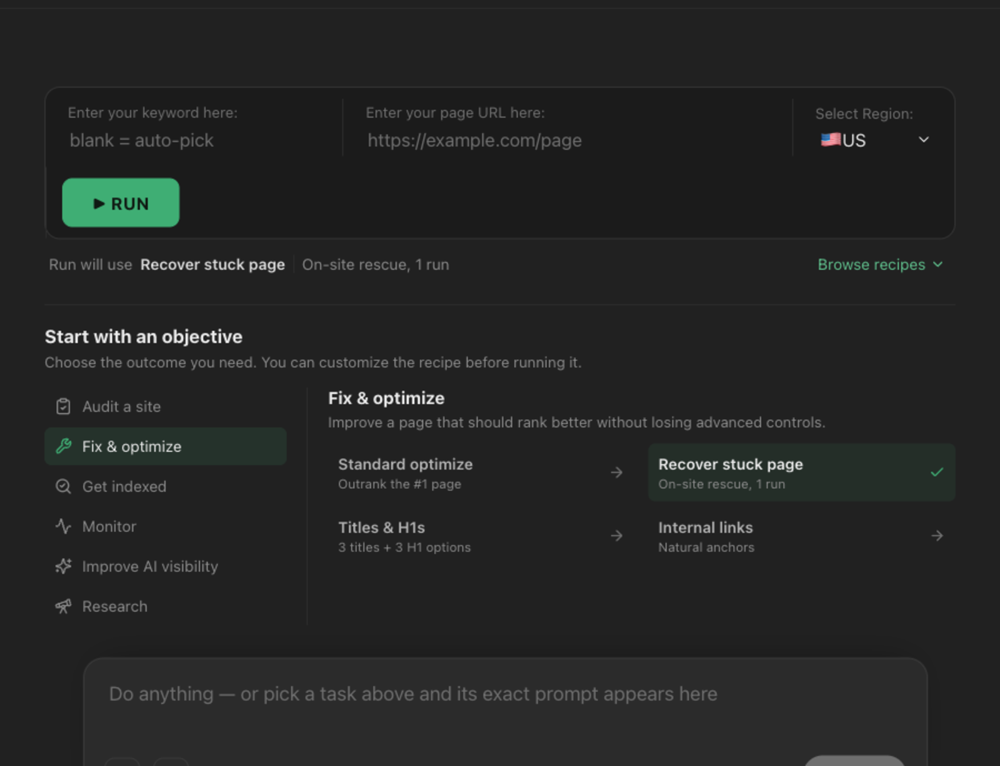
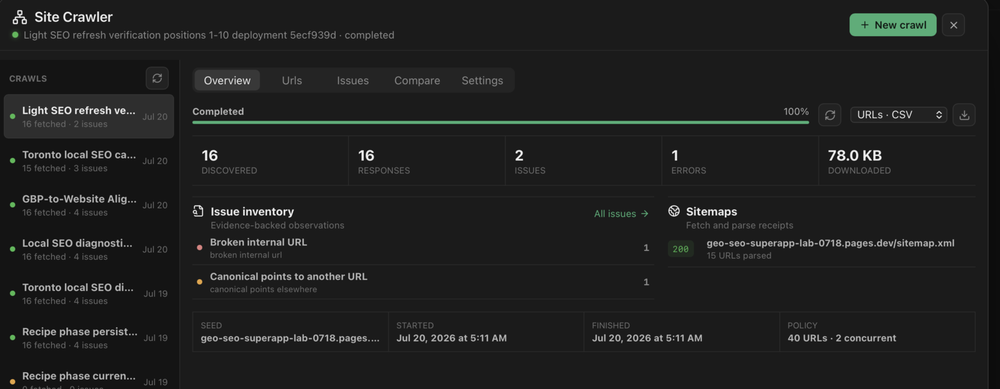
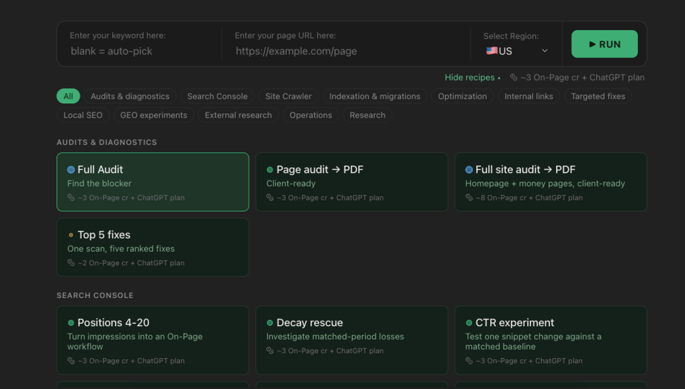
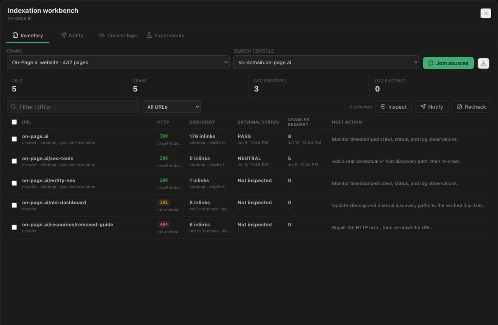

  

<h1 align="center">GEO SEO SuperApp</h1>

  A free macOS workspace for SEO and GEO agencies.

  <a href="https://api.on-page.ai/superapp"><strong>Product page</strong></a>
  ·
  <a href="https://github.com/on-page-ai/geo-seo-superapp/releases/latest"><strong>Download</strong></a>
  ·
  <a href="https://api.on-page.ai/superapp/privacy"><strong>Privacy</strong></a>
  ·
  <a href="https://github.com/on-page-ai/geo-seo-superapp/issues"><strong>Support</strong></a>

## Work from the objective

GEO SEO SuperApp brings recurring agency workflows into one desktop workspace:

- Create page reports and guided optimizations from a keyword and URL.
- Run technical site crawls and send important findings into deeper analysis.
- Review Google Search Console and Bing Webmaster Tools observations.
- Schedule On-Page.ai scans and visible browser QA.
- Manage indexation evidence, sitemap submissions, and a personal indexing site.
- Connect owned websites, browser profiles, social accounts, Cloudflare, and optional MCP services.
- Build, rearrange, and share reusable SEO recipes.

The app is free. It does not add a separate SuperApp subscription.

## Download and install

1. Open the [latest release](https://github.com/on-page-ai/geo-seo-superapp/releases/latest).
2. Download `GEO.SEO.SuperApp_aarch64.dmg`.
3. Open the disk image and move **GEO SEO SuperApp** to Applications.
4. Launch the app and follow the two-step core setup.

The installer is signed with an Apple Developer ID, notarized by Apple, and
stapled for Gatekeeper verification. Releases include SHA-256 checksums.

### Requirements

- Apple silicon Mac
- macOS 11 or later
- A ChatGPT account for the AI agent
- An On-Page.ai account for the core SEO analysis workflows

Google Search Console, Bing Webmaster Tools, Cloudflare, Chrome, Edge, Brave,
social networks, owned websites, and third-party data services are optional.
Each connected service retains its own account, plan, and usage requirements.

## Start with the essentials

The first run asks for only the two connections needed for the core workflows:

1. **AI setup** - sign in with the ChatGPT account you already use.
2. **On-Page.ai** - connect the SEO data used for entities, categorization,
   competitive evidence, content depth, and information gain.

Everything else lives in the Setup Center and can be connected later.

See [Getting started](docs/GETTING_STARTED.md) for the complete setup path.

## Built for weekly agency work

### Crawl and diagnose

Review technical issues, sitemaps, structured data, crawl depth, redirects, and
page inventories without leaving the client workspace.

### Select or build a recipe

Use guided recipes for reports, optimization, internal links, Search Console
opportunities, indexation, monitoring, GEO research, and more. Custom recipes
can be described in plain language, edited, reordered, or removed.

### Keep indexation evidence together

Track what was crawled, submitted, observed by providers, and seen in server
logs. Submission receipts are kept separate from indexing outcomes.

## Privacy and security

Projects and working data are stored locally on your Mac. Credentials and OAuth
tokens are stored in macOS Keychain. Connected providers receive data only when
their tools are used.

Read the full [privacy policy](https://api.on-page.ai/superapp/privacy) and
[security policy](SECURITY.md) before connecting production accounts.

## Support

- [Report a bug](https://github.com/on-page-ai/geo-seo-superapp/issues/new?template=bug_report.yml)
- [Request a workflow or feature](https://github.com/on-page-ai/geo-seo-superapp/issues/new?template=feature_request.yml)
- [Review known setup guidance](docs/GETTING_STARTED.md)

Please do not put API keys, OAuth tokens, site passwords, private URLs, or
client data in a public issue.

## Source availability

This repository distributes official signed releases and public user
documentation. It does **not** contain the proprietary application source code.
See [Source and licensing](SOURCE.md).
